  

## 🧭 &nbsp;About Me

I'm **Anupam Aryal**, a full stack developer from **Kathmandu, Nepal**, who enjoys turning
rough ideas into fast, responsive products people actually want to use.

Most of my time goes into the **React / Next.js / TypeScript** side of the stack, backed by
**FastAPI**, **PostgreSQL** and **Supabase** — and lately, an increasing amount of
**AI-assisted tooling** wired in with LangGraph.

 

## 🧰 &nbsp;Tech Stack

**Languages**

**Frontend**

**Backend**

**Databases**

**AI &amp; Agents**

**Cloud &amp; DevOps**

**Hosting &amp; Server Panels**

<!-- Featured Work — temporarily hidden. Uncomment to bring it back.

## 🚀 &nbsp;Featured Work

<table>
  <thead>
    <tr>
      <th align="left" width="24%">Project</th>
      <th align="left" width="40%">What it is</th>
      <th align="left" width="26%">Built with</th>
      <th align="left" width="10%">Links</th>
    </tr>
  </thead>
  <tbody>
    <tr>
      <td><b>The Transporter</b> office-file-management</td>
      <td>A workspace for uploading, organising and sharing office documents, with an AI layer for assisted document handling and email notifications.</td>
      <td>Next.js · TypeScript · Supabase · LangGraph · Tailwind · Radix UI</td>
      <td><a href="https://office-file-management-three.vercel.app">Live</a> · <a href="https://github.com/AnupamAryal7/office-file-management">Code</a></td>
    </tr>
    <tr>
      <td><b>ACT Capital Driving School</b></td>
      <td>Client project — a responsive marketing and enrolment site for a driving school, focused on fast loads and clear conversion paths.</td>
      <td>React · Next.js · Tailwind · Vercel</td>
      <td><a href="https://act-capital-frontend.vercel.app/">Live</a></td>
    </tr>
    <tr>
      <td><b>Portfolio</b></td>
      <td>My personal site — the full case-study version of everything listed here.</td>
      <td>React · TypeScript · Vite</td>
      <td><a href="https://anupamaryal.com.np/">Live</a></td>
    </tr>
    <tr>
      <td><b>WebDevelover</b></td>
      <td>Where it started — hand-written HTML/CSS/JS pages from my first dive into web development.</td>
      <td>HTML · CSS · JavaScript</td>
      <td><a href="https://github.com/AnupamAryal7/WebDevelover">Code</a></td>
    </tr>
  </tbody>
</table>

-->

## 📊 &nbsp;GitHub Stats

  <!-- Rendered in this repo by .github/workflows/metrics.yml, so it never depends on a
       third-party service staying online. Refreshed daily. -->
  

    

  <picture>
    <source media="(prefers-color-scheme: dark)" srcset="https://streak-stats.demolab.com?user=AnupamAryal7&hide_border=true&theme=tokyonight&background=0B1120&ring=22D3EE&fire=A855F7&currStreakLabel=22D3EE&sideLabels=94A3B8&dates=64748B" />
    
  </picture>

    

  <picture>
    <source media="(prefers-color-scheme: dark)" srcset="https://github-readme-activity-graph.vercel.app/graph?username=AnupamAryal7&hide_border=true&area=true&bg_color=0B1120&color=E2E8F0&line=22D3EE&point=A855F7&title_color=22D3EE" />
    
  </picture>

### 🐍 &nbsp;Watch my contributions get eaten

  <picture>
    <source media="(prefers-color-scheme: dark)" srcset="https://raw.githubusercontent.com/AnupamAryal7/AnupamAryal7/output/snake-dark.svg" />
    <source media="(prefers-color-scheme: light)" srcset="https://raw.githubusercontent.com/AnupamAryal7/AnupamAryal7/output/snake-light.svg" />
    
  </picture>

## 🤝 &nbsp;Let's Connect

I'm always up for a good problem — freelance work, collaboration, or just talking shop about
the web, AI tooling, or chess openings.

 

  
   
  ⭐ If something here was useful, a star is always appreciated.

